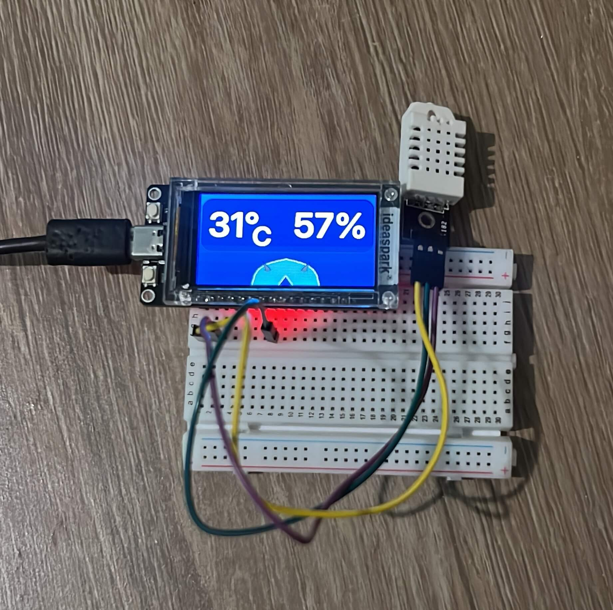

# Weather Report

<p align="center">
  
</p>

## Overview

This project displays real-time temperature and humidity data on an ESP32 device with a 320×170 IPS LCD screen. It uses DHT11 or DHT22 sensors for environmental data acquisition, LVGL for graphical interface rendering, and is built using the ESP-IDF framework.

The goal is to provide a lightweight, responsive, and visually appealing embedded weather monitoring system for educational and prototyping purposes.

---

## Demo

<p align="center">
  
</p>

---

## Features

- Real-time temperature and humidity monitoring
- Support for DHT11 and DHT22 sensors
- 320×170 IPS LCD display support
- Smooth graphical interface using LVGL
- Built with ESP-IDF (Espressif official framework)
- Lightweight and optimized for embedded systems

---

## Hardware Requirements

- ESP32 development board
- 320×170 IPS LCD display
- DHT11 or DHT22 sensor
- Jumper wires
- Breadboard (optional)

---

## Software Requirements

- ESP-IDF (Espressif IoT Development Framework)
- LVGL (Light and Versatile Graphics Library)
- FreeRTOS (included in ESP-IDF)

---

## Installation

```bash
git clone https://github.com/NisaelMoreiraGomes/weather-report.git

cd weather-report

git submodule update --init --recursive

idf.py set-target esp32
idf.py build
idf.py flash
```

## License

This project is licensed under the MIT License.
